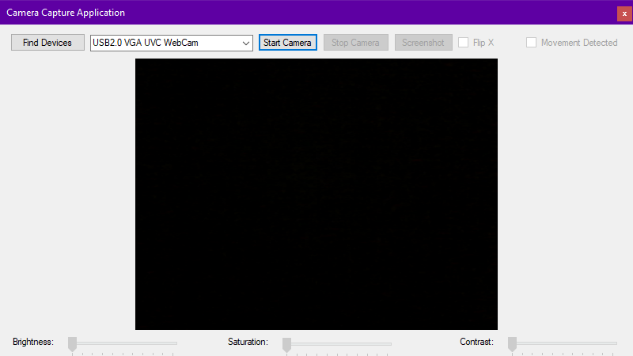

# Camera Capture
> Windows Froms Application for capturing video from a camera connected to your computer.

## Table of contents
- [Camera Capture](#camera-capture)
  - [Table of contents](#table-of-contents)
  - [General info](#general-info)
  - [Screenshots](#screenshots)
  - [Technologies](#technologies)
  - [Setup and run](#setup-and-run)
  - [Features](#features)
  - [Issues](#issues)
  - [Status](#status)
  - [Contact](#contact)

## General info
This project was created with the aim of learning how to write an application that works with any peripheral device (different from mouse or keyboard). The camera was the first choice. It turns out that with help of libraries, it is not as hard as I expected. For GUI I used Windows Forms, because it allows to design simple interface quite fast and is compatible with many libraries.

## Screenshots

## Technologies
* .NET Framework 4.7.2 Windows Forms with C#.
* AForge&#46;NET v2.2.5.
* Microsoft Windows system.

## Setup and run
In order to run this project, tools mentioned in [Technologies](#technologies) section are required. The easiest way is to open this project in Visual Studio 2019, install AForge&#46;NET v2.2.5 via NuGet Package Manager and build solution. Program runs only on Windows system (developed and tested on Windows 10).

## Features
List of features:
* Detect all cameras connected to your computer.
* Choose the camera that you want to use.
* Start/stop video capture.
* Display captured video.
* Flip video horizontally.
* Take a screenshot and save it in choosen location.
* Movement detection.
* Brightness, saturation and contrast (however, due to negative, heavy performance impact, these options are disabled). 

To-do ideas:
* Fix brightness, saturation and contrast settings, so they do not cause performance drop.
* Add more settings (e.g. flip video, rotate video, apply filters).
* Add option for saving captured video.
* Add sound support.

## Issues
The major issue is heavy performance drop when brightness, saturation and contrast settings are enabled (because each filter is applied separately on each frame of the video). Besides, movement detections is not stable, which means that it may detect movement even when there is no any.

## Status
Altough there are interesting features that might be added, this project is no longer developed.

## Contact
Created by [@michaltkacz](https://github.com/michaltkacz) - feel free to contact me!